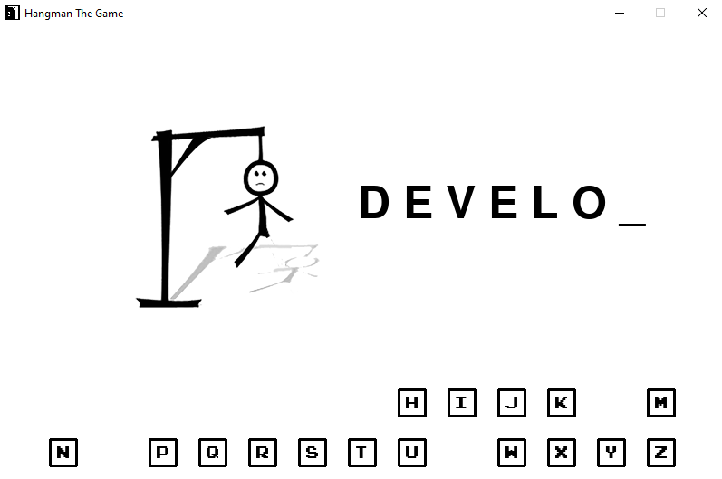

# HangThePyMan

> Classic Hangman game with Pygame & Python touch.

Implementation of the hangman game in Pygame. With the ability to ask today's word, most used & searched words and bunch of other fun options to play.



## Installation

Pip:

```sh
pip install hangthepyman --user
```

Source:

After cloning head to hangthepyman directory and run:

```sh
python3 the_hangman.py
```

## TODO's

- Add Menu
- Add Music
- Complete word functions to improve asked words and add hint option

## Release History

- 0.0.1
  - Created the game :)

## Meta

Berkay Girgin – [@Gerile3](https://github.com/Gerile3) – berkay.grgn@protonmail.com

Distributed under the MIT license. See ``LICENSE`` for more information.

## Contributing

1. Fork it (<https://github.com/Gerile3/HangThePyMan/fork>)
2. Create your feature branch (`git checkout -b feature/fooBar`)
3. Commit your changes (`git commit -am 'Add some fooBar'`)
4. Push to the branch (`git push origin feature/fooBar`)
5. Create a new Pull Request
